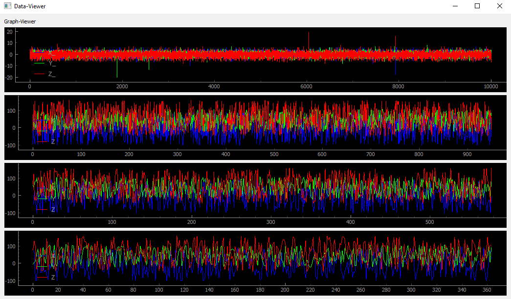

# Data-Viewer
This is a simple universal data viewer for an arbitrary number of plots.
The Data-Viewer interfaces with clients through a tcp-socket where it is 
provided with instructions for setting up the plot and the data, which has to 
be added to the plot. The transmitted data has to be formatted as json.

## Plotting Example



## Data format example
- Each connected device needs a unique name
- Number of legend items, color items and payload lists must be equivalent
- len is the maximum data points plotted in the graph (oldest data is removed automatically)

```py
dict = {
    "name": "Testsensor2",
    "legend": ["X", "Y", "Z"],
    "colors": ['b', 'g', 'r'],
    "len": 2000,
    "payload": [[0], [0], [0]]
}
```

### Future additions, suggestions
- Capability to stop single graphs
- Removing graphs (currently the application needs to be restarted)
